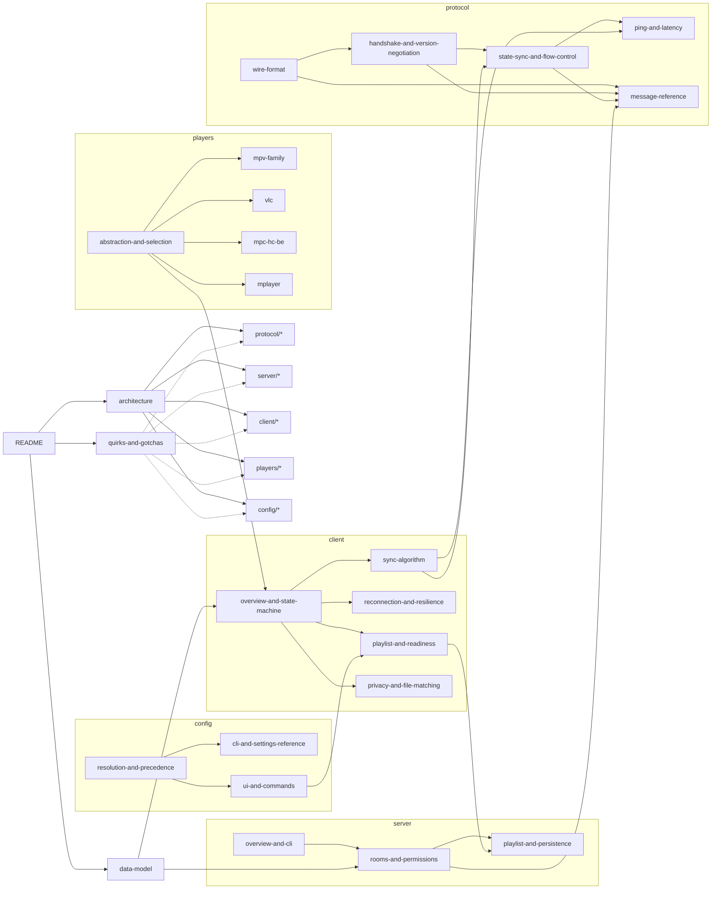

# Syncplay — Reimplementation Specification

This is a from-source technical spec of Syncplay, written so a team could build a
**wire-compatible** client and server from scratch without access to the original Python
codebase. Unlike `../../docs/` (a mirror of the public marketing/user docs), everything here is
derived from reading the actual implementation — every claim is anchored with a `file:line`
reference into `../../source/syncplay/`. Where the real behavior is subtle, surprising, or
undocumented externally, that is called out explicitly rather than smoothed over — a faithful
reimplementation needs the quirks as much as the clean parts. See
[`quirks-and-gotchas.md`](quirks-and-gotchas.md) for the concentrated list.

Nodes are cross-linked like a graph — follow **Related** / inline links rather than reading
top-to-bottom. Every doc that describes wire behavior links back to
[`protocol/message-reference.md`](protocol/message-reference.md); every doc that describes an
in-memory object links back to [`data-model.md`](data-model.md).

## Graph overview

## Nodes

### Foundation
- [`architecture.md`](architecture.md) — process model, tech stack, how client/server/player fit together
- [`data-model.md`](data-model.md) — every in-memory entity (Room, Watcher, SyncplayUser, Playlist, PlayState) referenced across every other doc
- [`quirks-and-gotchas.md`](quirks-and-gotchas.md) — concentrated list of non-obvious/surprising behavior; read this before assuming any "obvious" design choice

### Protocol (wire format — implement this first; everything else builds on it)
- [`protocol/wire-format.md`](protocol/wire-format.md) — framing, line length limits, JSON envelope
- [`protocol/handshake-and-version-negotiation.md`](protocol/handshake-and-version-negotiation.md) — Hello, the 1.2.255 compatibility hack, feature-flag negotiation
- [`protocol/state-sync-and-flow-control.md`](protocol/state-sync-and-flow-control.md) — the `ignoringOnTheFly` handshake that prevents feedback loops
- [`protocol/ping-and-latency.md`](protocol/ping-and-latency.md) — RTT/EWMA/forward-delay algorithm shared by client and server
- [`protocol/message-reference.md`](protocol/message-reference.md) — exact schema for every message type (Hello/Set/List/State/Chat/TLS/Error)

### Server
- [`server/overview-and-cli.md`](server/overview-and-cli.md) — factory/protocol class structure, reactor wiring, full CLI flag reference
- [`server/rooms-and-permissions.md`](server/rooms-and-permissions.md) — room lifecycle, room isolation, managed/controlled rooms and operator auth
- [`server/playlist-and-persistence.md`](server/playlist-and-persistence.md) — server-side playlist validation, MOTD templating, stats DB, room persistence

### Client
- [`client/overview-and-state-machine.md`](client/overview-and-state-machine.md) — `SyncplayClient` object model, position tracking, local vs. global state
- [`client/sync-algorithm.md`](client/sync-algorithm.md) — the seek/pause/rewind/fast-forward/slowdown decision tree and every numeric threshold
- [`client/reconnection-and-resilience.md`](client/reconnection-and-resilience.md) — backoff policy, state restoration, username collision handling
- [`client/playlist-and-readiness.md`](client/playlist-and-readiness.md) — shared playlist client logic, readiness system, auto-play
- [`client/privacy-and-file-matching.md`](client/privacy-and-file-matching.md) — filename/filesize privacy modes, the file-matching heuristics, "Set Offset"

### Player integration
- [`players/abstraction-and-selection.md`](players/abstraction-and-selection.md) — the (thin) `BasePlayer` interface and path-based player selection
- [`players/mpv-family.md`](players/mpv-family.md) — mpv, mpv.net, IINA, Memento (all mpv-JSON-IPC-derived)
- [`players/vlc.md`](players/vlc.md) — VLC's Lua telnet interface
- [`players/mpc-hc-be.md`](players/mpc-hc-be.md) — Windows COPYDATA slave-mode protocol
- [`players/mplayer.md`](players/mplayer.md) — stdin/stdout slave-mode protocol

### Configuration & UI
- [`config/resolution-and-precedence.md`](config/resolution-and-precedence.md) — the defaults → ini → CLI → GUI-prompt → per-directory `.syncplay` precedence chain
- [`config/cli-and-settings-reference.md`](config/cli-and-settings-reference.md) — every CLI flag and every config key, with types/defaults
- [`config/ui-and-commands.md`](config/ui-and-commands.md) — GUI structure, console mode, and the full chat slash-command dispatch table

## Ground truth facts (referenced throughout)

| | |
|---|---|
| Client version at time of analysis | 1.7.6 (`syncplay/__init__.py:1`) |
| Wire framing | Newline-delimited JSON over TCP (Twisted `LineReceiver`, default `\r\n` delimiter, 16384-byte line cap) |
| Protocol timeout | 12.5s (`PROTOCOL_TIMEOUT`, `constants.py:76`) — **not** 4s as public docs state |
| Server state broadcast interval | 1s (`SERVER_STATE_INTERVAL`, `constants.py:78`) |
| Default port | 8999 (`constants.py`, `DEFAULT_PORT`) |
| License | Apache 2.0 |

## How to use this spec to reimplement Syncplay

1. Start with [`protocol/wire-format.md`](protocol/wire-format.md) through
   [`protocol/message-reference.md`](protocol/message-reference.md) — build a minimal server that
   can complete a Hello handshake and echo State messages. Test it against the real client.
2. Read [`server/overview-and-cli.md`](server/overview-and-cli.md) and
   [`server/rooms-and-permissions.md`](server/rooms-and-permissions.md) to add room routing,
   broadcast, and managed-room auth.
3. Build a client following [`client/overview-and-state-machine.md`](client/overview-and-state-machine.md)
   and [`client/sync-algorithm.md`](client/sync-algorithm.md) — this is the part most sensitive to
   getting numeric thresholds exactly right, since mismatched thresholds between reimplementation
   and reference client cause visible desync fighting.
4. Add one player integration (mpv is the reference target — see
   [`players/mpv-family.md`](players/mpv-family.md)) before attempting the others.
5. Add config loading ([`config/resolution-and-precedence.md`](config/resolution-and-precedence.md))
   and a UI last — the wire protocol and sync algorithm are the parts that must be bit-compatible;
   config/UI only need to be behaviorally equivalent.
6. Cross-check every deviation against [`quirks-and-gotchas.md`](quirks-and-gotchas.md) before
   deciding it's a bug worth fixing rather than a compatibility requirement.
