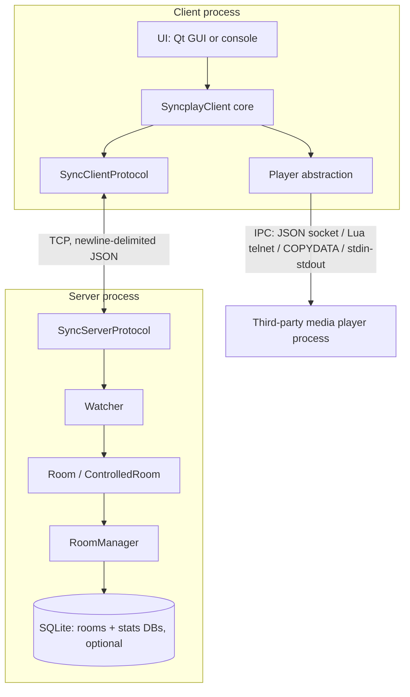

# System Architecture

## Process model

Two independent executables share one Python package (`syncplay/`):

- **`syncplayClient.py`** → `syncplay/ep_client.py` → builds a `ConfigurationGetter`
  (config resolution, [`../config/resolution-and-precedence.md`](../config/resolution-and-precedence.md)),
  a UI ([`../config/ui-and-commands.md`](../config/ui-and-commands.md)), and a
  `SyncplayClientManager` (`syncplay/clientManager.py`) which instantiates `SyncplayClient`
  ([`../client/overview-and-state-machine.md`](../client/overview-and-state-machine.md)) and
  starts the Twisted reactor. The client is a single OS process that also spawns/controls a
  **separate third-party media player process** (mpv, VLC, MPC-HC, …) via
  [`../players/abstraction-and-selection.md`](../players/abstraction-and-selection.md).
- **`syncplayServer.py`** → `syncplay/ep_server.py` → builds a `SyncFactory`
  ([`../server/overview-and-cli.md`](../server/overview-and-cli.md)) and binds TCP4/TCP6
  endpoints. The server has no UI and no player — it is a pure message relay plus room/state
  authority.

Both are single-threaded, single-process, event-driven Twisted applications (one reactor each).
There is no multi-process/multi-reactor sharding on the server — see the scaling note in
[`quirks-and-gotchas.md`](../quirks-and-gotchas.md).

## Component diagram

## Tech stack

| Layer | Technology |
|---|---|
| Networking | Twisted (`twisted.protocols.basic.LineReceiver`, `twisted.internet.endpoints`, `twisted.internet.ssl`) |
| Wire format | JSON (stdlib `json`), one object per line |
| Client GUI | Qt via PySide2/PySide6 (auto-detected; falls back to console mode on import failure) |
| Client console | Plain `threading.Thread` + blocking `input()` loop |
| Server persistence | SQLite via `twisted.enterprise.adbapi` (optional; rooms DB + stats DB are separate files/schemas) |
| TLS | PyOpenSSL + Twisted `ssl.CertificateOptions`, negotiated in-band (STARTTLS-style), not a separate listener |
| Player IPC | Player-specific: mpv-family uses a vendored JSON-IPC library + Lua script; VLC uses a bundled Lua telnet interface script; MPC-HC/BE uses Windows `WM_COPYDATA`; mplayer uses stdin/stdout slave mode |
| i18n | Hand-written per-language Python dict modules (`messages_XX.py`), 13 languages |
| Packaging | py2exe (Windows), py2app (macOS), `setup.py`/`make install` (Linux), Deb packages, formerly Snap/AppImage |

## Why this shape

- **Server is deliberately dumb about content**: it never touches a media file, never knows
  what a video is — it only relays position/pause/seek numbers and opaque filename/size/duration
  metadata (privacy-scrubbed by the client — see
  [`client/privacy-and-file-matching.md`](../client/privacy-and-file-matching.md)). This is what
  makes the protocol player-agnostic.
- **All player-specific logic is isolated behind one abstraction** (`BasePlayer`,
  [`players/abstraction-and-selection.md`](../players/abstraction-and-selection.md)), but that
  abstraction is a stub interface with no shared implementation — every concrete player
  reimplements process launch, IPC, and polling/extrapolation independently. A reimplementation
  should treat "support one more player" as "write one more mostly-standalone module," not
  "extend a rich base class."
- **The sync algorithm lives entirely in the client**, not the server
  ([`client/sync-algorithm.md`](../client/sync-algorithm.md)) — the server only picks an
  authoritative position (whichever connected watcher is furthest behind, see
  [`server/rooms-and-permissions.md`](../server/rooms-and-permissions.md)) and relays it; every
  client independently decides whether to seek/pause/slow down/fast-forward in response. This
  means protocol compatibility alone is not sufficient for a good user experience — a
  reimplementation's sync algorithm needs to match thresholds in
  [`client/sync-algorithm.md`](../client/sync-algorithm.md) closely enough that mixed-client rooms
  don't fight each other.
