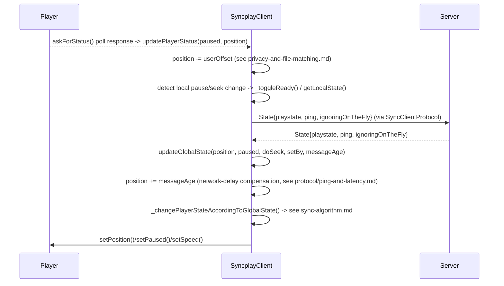

# Client: Overview & State Machine

Entity fields: [`../data-model.md`](../data-model.md#syncplayclient-clientpy62).

## Startup sequence

`SyncplayClientManager.run()` (`clientManager.py`) loads config
([`../config/resolution-and-precedence.md`](../config/resolution-and-precedence.md)), builds a
UI ([`../config/ui-and-commands.md`](../config/ui-and-commands.md)), instantiates
`SyncplayClient(playerClass, ui, config)`, then calls `.start(host, port)`, which starts the
Twisted reactor and blocks until exit.

## Two independently-tracked clocks

The entire sync algorithm ([`sync-algorithm.md`](sync-algorithm.md)) is built on comparing two
wall-clock-extrapolated position estimates, **not** by polling the player and server every tick:

- **Local/player state**: `_playerPosition`, `_playerPaused`, `_lastPlayerUpdate`.
  `getPlayerPosition()` (`client.py:483`) returns `_playerPosition` if paused, or
  `_playerPosition + (time.time() - _lastPlayerUpdate)` if playing — extrapolated, not re-polled.
- **Global/room-authoritative state**: `_globalPosition`, `_globalPaused`, `_lastGlobalUpdate`.
  `getGlobalPosition()` (`client.py:506`) is the same extrapolation applied to the last `State`
  message received from the server.

Both are recomputed on demand rather than updated continuously — a design that trades minor
CPU/complexity for not needing a dedicated ticking loop to keep two numbers current. **Caveat**:
because this is wall-clock-based, a `time.time()` jump (system clock adjustment, VM
pause/resume) produces transiently wrong computed positions until the next real update arrives.

## Update flow

## Key subsystems (each documented separately)

- [`sync-algorithm.md`](sync-algorithm.md) — the seek/rewind/fast-forward/slowdown/pause
  decision tree and every numeric threshold.
- [`reconnection-and-resilience.md`](reconnection-and-resilience.md) — backoff policy and what
  state is restored after a dropped connection.
- [`playlist-and-readiness.md`](playlist-and-readiness.md) — shared playlist logic, readiness,
  auto-play.
- [`privacy-and-file-matching.md`](privacy-and-file-matching.md) — filename/size privacy modes,
  the file-matching heuristics, and the "Set Offset" mechanism.

## Other top-level classes in `client.py`

| Class | Purpose |
|---|---|
| `SyncClientFactory` | Twisted `ClientFactory`; builds `SyncClientProtocol` instances |
| `SyncplayUser` (`client.py:1308`) | Per-user model — see [`../data-model.md`](../data-model.md) |
| `SyncplayUserlist` (`client.py:1373`) | Room membership + readiness aggregation |
| `UiManager` (`client.py:1680`) | Throttles/merges OSD messages before forwarding to the real UI |
| `_WarningManager` (nested, `client.py:1188`) | Periodic OSD warnings (file mismatch, alone in room, not all ready) |
| `SyncplayPlaylist` (`client.py:1790`) | Shared playlist state machine — [`playlist-and-readiness.md`](playlist-and-readiness.md) |
| `FileSwitchManager` (`client.py:2202`) | Background directory scanner resolving playlist filenames to local paths |

## Player callback contract

The client doesn't poll a generic "player" interface synchronously in real time; instead each
player integration ([`../players/abstraction-and-selection.md`](../players/abstraction-and-selection.md))
calls back into a small set of `SyncplayClient` methods:

- `initPlayer(playerInstance)` — once the player/IPC connection is ready.
- `updateFile(filename, duration, filepath)` — a new file was detected as loaded.
- `updatePlayerStatus(paused, position)` — response to a poll (`askForStatus`).
- `getGlobalPosition()` / `getGlobalPaused()` — read authoritative state (used by players right
  after a file switch, to seek to the group's position immediately rather than starting at 0).
- `stop(promptForAction=False)` — the player process/connection died.
- `eofReportedByPlayer()` — mpv-family only, currently.

This callback contract is the actual "interface boundary" a reimplementation needs to replicate
between its own sync core and any player-integration module — more so than `BasePlayer`'s
(mostly unused) abstract method list.
