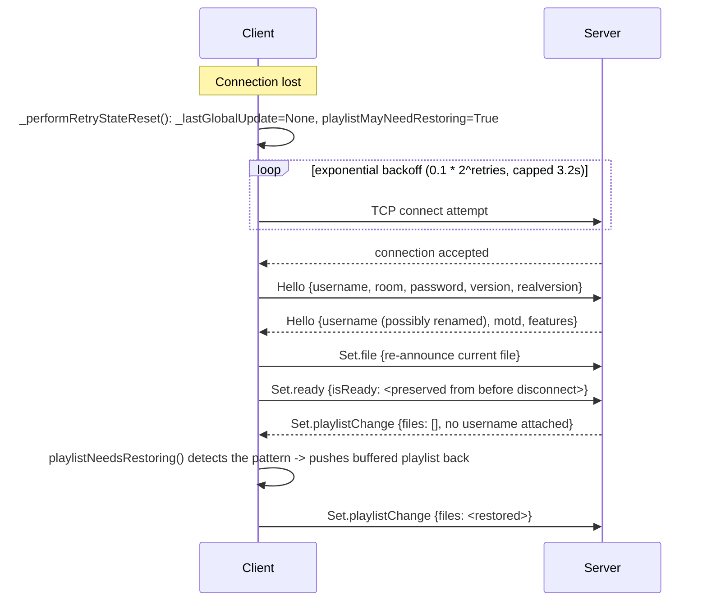

# Client: Reconnection & Resilience

## Backoff policy

`SyncplayClient.start()` (`client.py:844-905`) builds a Twisted `ClientService` with a custom
`retryPolicy`:
```python
def retry(retries):
    return 0.1 * (2 ** min(retries, 5))   # exponential backoff, capped at 0.1*32 = 3.2s
```
`RECONNECT_RETRIES` is effectively unbounded (999) — the client gives up only after an extreme
retry count, showing a connection-failed error.

## Per-attempt reset (`_performRetryStateReset`, `client.py:920-929`)

Runs before every retry: clears `_lastGlobalUpdate = None`, disables the SSL-mode UI indicator,
sets `playlistMayNeedRestoring = True` (see below), shows a "reconnection-attempt" notice, sets
`reconnecting = True`. On the very first retry (`retries == 0`) it also calls `onDisconnect()`
(pause-on-leave handling, if `pauseOnLeave` config is set).

`manualReconnect()` (`client.py:931-954`) exposes the same reset+restart path for a
user-triggered "Reconnect" action (the button added in the 1.7.1/1.7.5 changelogs), directly
stopping/restarting the `ClientService`.

## What survives a reconnect

A brand-new `SyncClientProtocol` is created per connection attempt — its `ignoringOnTheFly`
counters (see [`../protocol/state-sync-and-flow-control.md`](../protocol/state-sync-and-flow-control.md))
reset to 0 and any in-flight self-change tracking is simply abandoned. What the *client object*
itself carries across:

| State | Mechanism |
|---|---|
| Username/room | Live on `userlist.currentUser`, never cleared on disconnect; re-sent in every new `Hello` |
| Current file | `userlist.currentUser.file` persists; re-announced via `sendFile()` once `connected()` fires post-Hello |
| Ready state | `connected()` (`client.py:787-794`) computes `readyState = config['readyAtStart'] if currentUser.isReady() is None else currentUser.isReady()` — preserves the pre-disconnect ready state, falling back to configured default only the very first time |
| Controller identity | `reIdentifyAsController()` (`client.py:769-775`) re-sends the stored control password for controlled rooms |
| Playlist | See below — inferred restoration, not explicit request/response |

## Playlist restoration (inferred, not an explicit protocol feature)

`playlistMayNeedRestoring` is set on every retry attempt. Consumed by
`SyncplayPlaylist.playlistNeedsRestoring()` (`client.py:2039-2042`): if the client has a
non-empty **locally buffered** playlist, and the server's post-rejoin `playlistChange` reports an
**empty** file list with **no `username`** attached (i.e. a fresh/empty room state, not a
remote user's edit), the client interprets this as "the room forgot my playlist" and pushes its
buffer back up via `changePlaylist()`.

This is a heuristic, not an explicit "restore my playlist" protocol message — **any other
scenario that happens to produce an empty, no-username `playlistChange` while this flag is set
will trigger the same restore**, which is a source of subtle false-positive restores in edge
cases. A reimplementation could instead add an explicit restore request/response, but must still
handle this inferred pattern to interoperate with the current reference server (which has no
such explicit message).

## Username collision resolution ("fewest trailing underscores")

This behavior — described in the 1.7.5 changelog as a client-facing improvement — is entirely
**server-side** logic, not something the client computes; the client only receives whatever
(possibly renamed) username the server's Hello reply contains and calls `setUsername(username)`.
Full algorithm: [`../server/rooms-and-permissions.md#room-lifecycle`](../server/rooms-and-permissions.md).

## Sequence: a dropped connection and recovery


