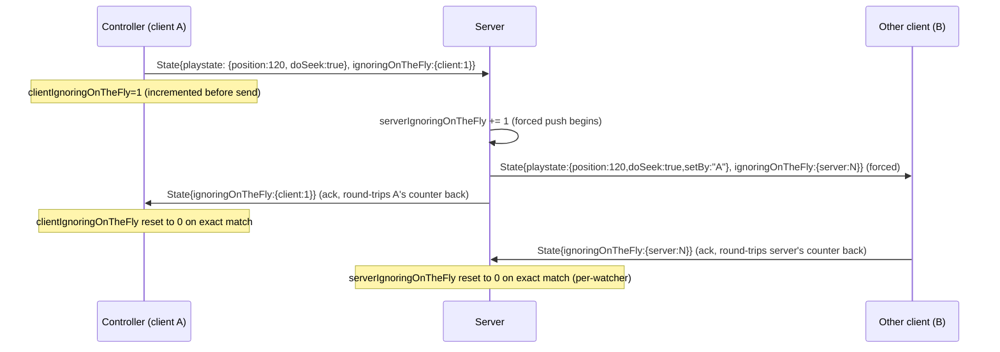

# Protocol: State Sync & `ignoringOnTheFly` Flow Control

This is the single most subtle part of the wire protocol. Get it wrong and a reimplementation
will either apply stale/echoed position updates (causing visible fighting between client and
server over who's "correct") or stop syncing altogether.

## Purpose

When a client (or the server, on behalf of a controller) issues an authoritative change — a
seek, a pause/unpause — the *other* side may still have the *old* state in flight (already
queued to send, or just sent and not yet superseded). Applying that stale echo as if it were
new user intent would create a feedback loop: A seeks → B receives old position from A → B
"corrects" back → A sees B's old-position echo and "corrects" again, etc. `ignoringOnTheFly` is
a stop-and-wait acknowledgment handshake layered on top of continuous best-effort state
broadcast, specifically to suppress this.

## The two counters

Both `SyncClientProtocol` and `SyncServerProtocol` maintain **two independent counters each**:
`clientIgnoringOnTheFly` and `serverIgnoringOnTheFly` (`protocols.py:73-74` client-side,
mirrored server-side per-watcher-connection). Despite the names, these do **not** mean "my own
counter" vs. "the peer's counter" — they represent "count of client-initiated on-the-fly
changes still unacknowledged" and "count of server-initiated on-the-fly changes still
unacknowledged," and **both protocol objects track both**, so client and server can each have a
pending self-initiated change independently and simultaneously.

## Client side (`protocols.py:277-318`)

**Incrementing**: whenever the client is about to send a `State` with `stateChange=True` (i.e.
its own player just changed pause/seek state locally, not in reaction to an incoming message) →
`clientIgnoringOnTheFly += 1`, before the send.

**Sending** (`sendState`, `protocols.py:294-318`): if either counter is nonzero, the outbound
message's `ignoringOnTheFly` dict includes whichever is nonzero. After including `server`, it is
**zeroed locally** (one-shot forward of the acknowledgment); `client` is left as-is until the
server itself round-trips the same value back.

**Gating what's sent**: the `playstate` block is only included if
`clientIgnoringOnTheFly == 0 OR serverIgnoringOnTheFly != 0` (`protocols.py:297-298`) — i.e. the
client stops actively pushing its own position while a self-initiated change is still
unacknowledged, unless the server has independently signaled a fresh forced round.

**Receiving** (`handleState`, `protocols.py:277-284`):
- Incoming `ignoringOnTheFly.server` present → adopt into `serverIgnoringOnTheFly`, **and
  unconditionally reset `clientIgnoringOnTheFly = 0`** — a server acknowledgment of any state
  change implicitly clears the client's own pending flag too.
- Incoming `ignoringOnTheFly.client` present **and equal to** the client's current
  `clientIgnoringOnTheFly` → reset to 0 (this is the actual round-trip confirmation: the server
  has seen and processed exactly this counter value).

**Gating what's applied**: incoming `playstate` is applied (`updateGlobalState`) only if
`position is not None and paused is not None and clientIgnoringOnTheFly == 0`
(`protocols.py:289`) — while a local change is still unacknowledged, incoming state is ignored
entirely, not merely deprioritized.

## Server side (`protocols.py:452-459,745-782`)

**Incrementing**: in `sendState(..., forced)`, if `forced` (an authoritative push triggered by
e.g. a controller's seek propagating to the room) → `serverIgnoringOnTheFly += 1`.

**Sending**: mirrors the client, but here it's `clientIgnoringOnTheFly` that gets zeroed after
inclusion; `serverIgnoringOnTheFly` persists until round-tripped back by the client.

**Receiving** (`handleState`, `protocols.py:766-772`):
- Incoming `ignoringOnTheFly.server` **equal to** the server's own pending value → reset to 0
  (exact-match round-trip ack, same pattern as the client's `client` handling).
- Incoming `ignoringOnTheFly.client` present → **unconditionally adopt** into
  `clientIgnoringOnTheFly = ignore["client"]`, **no equality check** — this is asymmetric versus
  how `server` is handled on both sides; a reimplementation must replicate this exact asymmetry
  (adopt-unconditionally vs. adopt-only-if-matching) or risk desyncing the flow-control state
  itself.

**Gating what's applied**: incoming `playstate` is applied to the watcher only if
`serverIgnoringOnTheFly == 0` (`protocols.py:781-782`).

**Gating what's sent**: the **entire** `State` message (not just `playstate` — including the
ping/RTT exchange) is withheld unless `serverIgnoringOnTheFly == 0 OR forced`
(`protocols.py:754-755`). This means ping/RTT sampling itself pauses during a pending forced
update — see the note in [`ping-and-latency.md`](ping-and-latency.md) about forward-delay
averages looking stale for about one round trip after a forced seek/pause.

## Sequence diagram: a controller-initiated seek in a managed room

## Implementation checklist for a reimplementation

- [ ] Track both counters on both client and server protocol objects, per connection.
- [ ] Increment `clientIgnoringOnTheFly` client-side before sending any self-initiated state
      change; increment `serverIgnoringOnTheFly` server-side before any forced push.
- [ ] Zero `ignoringOnTheFly.server` after sending it (both sides); leave `.client` un-zeroed
      until externally acknowledged.
- [ ] On receipt: `server` field → adopt + (client-side only) also zero `clientIgnoringOnTheFly`.
- [ ] On receipt: `client` field → client-side requires **exact match** to zero; server-side
      **unconditionally adopts** with no match check. Do not "fix" this asymmetry — it's load
      bearing for existing-client compatibility.
- [ ] Suppress applying incoming `playstate` while the local ignoring-counter (client's own
      `clientIgnoringOnTheFly`, or the server's own `serverIgnoringOnTheFly`) is nonzero.
- [ ] Server: suppress sending the *entire* State message (not just playstate) while
      `serverIgnoringOnTheFly != 0`, unless this is itself a forced send.
