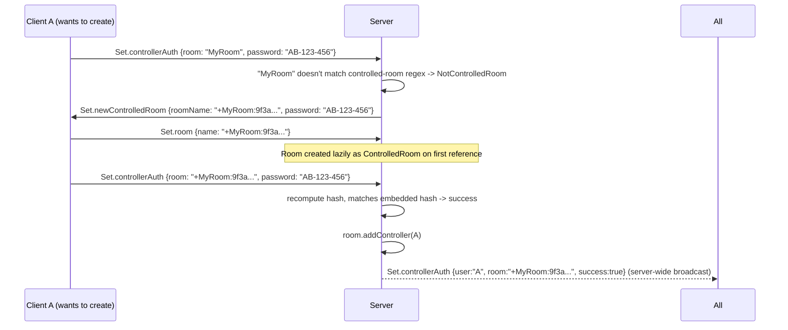

# Server: Rooms, Isolation & Managed-Room Permissions

Entity reference: [`../data-model.md`](../data-model.md) (`Room`, `ControlledRoom`, `Watcher`,
`RoomManager`).

## Room lifecycle

- **Creation**: lazy, in `RoomManager._getRoom()` (`server.py:485-494`) — first reference to a
  name creates it. If the name matches `^\+(.*):(\w{12})$` it becomes a `ControlledRoom`,
  otherwise a plain `Room`.
- **Destruction**: `_deleteRoomIfEmpty()` (`server.py:496-502`), called whenever a watcher
  leaves. A room survives being empty only if: it's `_permanent` (from
  `--permanent-rooms-file`), OR it's persistent (`--rooms-db-file` set) **and** its playlist is
  non-empty. Room names ending in `-temp` or containing `-temp:` are always non-persistent
  regardless of the rooms DB (`isMarkedAsTemporary`, `server.py:561-563`) — an explicit escape
  hatch for ephemeral rooms even when persistence is globally on.
- **Switching rooms**: client sends `Set.room` ([`../protocol/message-reference.md`](../protocol/message-reference.md)).
  Routed to `SyncFactory.setWatcherRoom()` (`server.py:131-145`): truncates name to 35 chars,
  calls `RoomManager.moveWatcher()` (removes from old room, possibly deleting it; adds to/creates
  new room), broadcasts a room-switch notice, and immediately pushes the new room's
  playlist/index/pause-state to the joining watcher. If the new name matches the
  controlled-room pattern, also re-sends `sendControlledRoomAuthStatus` for existing controllers
  so the joiner's UI reflects current operators.
- **Username uniqueness is global, not per-room** — `RoomManager.findFreeUsername()`
  (`server.py:504-514`) checks across *every* room. Algorithm (relevant to the "fewest trailing
  underscores" behavior mentioned in the 1.7.5 changelog — this logic is server-side, not
  client-side):
  ```python
  def findFreeUsername(self, username, maxUsernameLength):
      username = truncateText(username, maxUsernameLength)
      allnames = [w.getName().lower() for room in self._rooms.values() for w in room.getWatchers()]
      if username.lower() in allnames and username.endswith('_'):
          username = username.rstrip('_') or '_'   # strip existing trailing _ first, for determinism
      while username.lower() in allnames:
          username += '_'
      return username
  ```
  Note: truncation happens **before** suffixing, so appended underscores can push the final
  length back over `maxUsernameLength` — this is not re-truncated afterward.

## Room isolation (`--isolate-rooms`)

Swaps `RoomManager` for `PublicRoomManager` (`server.py:520-532`), which:
- Overrides `broadcast()` to call `broadcastRoom()` instead — every "tell everyone" call becomes
  "tell this room only."
- Overrides `getAllWatchersForUser` to return only the caller's own room's watchers (so userlists
  never reveal other rooms).
- `moveWatcher` explicitly sends a "left" notice to the old room before switching (isolation mode
  needs this to be explicit since watchers in other rooms won't otherwise see a broadcast leave).
- **Drops `--rooms-db-file`/`--permanent-rooms-file` support entirely** — `SyncFactory` only
  constructs a full `RoomManager` (with DB/permanent-room wiring) when `not isolateRooms`; under
  isolation it constructs a bare `PublicRoomManager()` with no arguments. Passing both flags
  together is not prevented, but persistence silently does nothing.

## Managed rooms & operator authentication

Logic in `utils.RoomPasswordProvider` (`utils.py:507-540`).

### Naming scheme

A controlled room's name on the wire is **not** the human-typed base name — it's a synthetic
string: `"+" + baseName + ":" + hash12`, matched by `CONTROLLED_ROOM_REGEX = r"^\+(.*):(\w{12})$"`.

### Password format

`PASSWORD_REGEX = r"[A-Z]{2}-\d{3}-\d{3}"` (e.g. `AB-123-456`), generated by
`RandomStringGenerator.generate_room_password()` (`utils.py:544-551`): 2 random uppercase
letters, dash, 3 random digits, dash, 3 random digits. Anything not matching this format raises
`ValueError` during auth.

### Hash computation (`_computeRoomHash`, `utils.py:533-540`)

```python
salt_hashed  = SHA256(salt)                                   # server's --salt, itself hashed first
provisional  = SHA256(roomBaseName_utf8 + salt_hashed_hexdigest)
roomHash     = SHA1(provisional_hexdigest + salt_hashed_hexdigest + password_utf8)[:12].upper()
```
This is a **bespoke construction, not HMAC** — and truncates a SHA1 digest to 12 hex chars (48
bits). `getControlledRoomName()` = `"+" + roomName + ":" + roomHash`.

### Auth flow (`SyncFactory.authRoomController`, `server.py:198-210`)

Triggered by client `Set.controllerAuth`:
1. If the current/target room name already matches the controlled pattern, recompute the hash
   from base name + supplied password + salt, compare (plain string equality, **not
   timing-safe**) to the hash embedded in the room name.
2. **Success**: `room.addController(watcher)` (adds to `ControlledRoom._controllers`) and
   broadcasts `sendControlledRoomAuthStatus(success, watcherName, roomName)` via
   `_roomManager.broadcast` — **to the entire server, not just the room** (unless isolated) —
   so every connected client anywhere learns who authenticated into which controlled-room hash,
   incidentally revealing controlled-room identities to unrelated users.
3. **`NotControlledRoom`** (client wants to *turn* a plain room into a controlled one): server
   computes the resulting controlled name and sends `Set.newControlledRoom` back so the client
   can `Set.room` into it. The name→password mapping is never stored server-side — it's
   deterministically re-derivable from base name + password + salt.
4. Any other `ValueError` (malformed password) → failure broadcast scoped to the room only
   (`broadcastRoom`, not `broadcast`).

### Permission gating

- `ControlledRoom.canControl(watcher)` (`server.py:718-719`) = `watcher.getName() in
  self._controllers` — **identity is a bare username string**, not a session/connection token.
  A second client that later connects and claims the *same username* in that room silently
  inherits controller status, since `_controllers` maps name → watcher and is simply overwritten
  on re-auth. **This is a username-spoofing = privilege-escalation vector** — call this out
  explicitly if reimplementing for any semi-trusted environment; consider binding controller
  status to a connection/session identifier instead.
- Plain `Room.canControl()` always returns `True` — non-controlled rooms have no gating
  whatsoever; anyone can seek/pause/edit the playlist.
- Everything that mutates shared state checks `canControl`: `ControlledRoom.setPaused`,
  `setPosition`, `setPlaylist`, `setPlaylistIndex`; at the factory level, `forcePositionUpdate`,
  `setPlaylist`, `setPlaylistIndex`, and "set someone else's readiness" all gate the same way. A
  rejected mutation from a non-controller is **not an error** — the server just replies with the
  current authoritative state to that one client, silently overriding their attempted change.

## Position authority

`Room.getPosition()` (`server.py:597-608`) = `min(self._watchers.values())`, using
`Watcher.__lt__` (position comparison, with file-less watchers sorting as "greater" so they're
never picked unless nobody has a file). **The watcher furthest behind is the position
authority**, re-derived roughly every second (tied to `SERVER_STATE_INTERVAL`) — there is no
single persistently "owned" canonical position outside of this continuous re-derivation.

## Sequence: creating and joining a managed room


